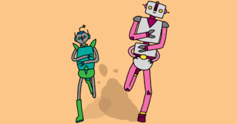

# Sprint scratch2

Find the project online at [projects.raspberrypi.org/en/projects/sprint-scratch2](https://projects.raspberrypi.org/en/projects/sprint-scratch2)

## Resources
For project materials and solutions, see [en/resources](https://github.com/raspberrypilearning/sprint-scratch2/tree/master/en/resources) and [en/solutions](https://github.com/raspberrypilearning/sprint-scratch2/tree/master/en/solutions).

## Contributing
See [CONTRIBUTING.md](CONTRIBUTING.md)

## Licence
See [LICENSE.md](LICENSE.md)