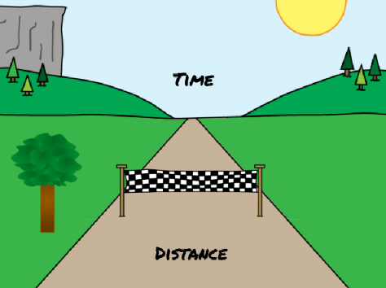
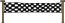
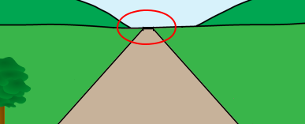

## On your marks...

Let's start by creating a race countdown.

--- task ---
Open the 'Sprint'  [starter project](http://rpf.io/p/en/sprint-scratch2-go){:target="_blank"} in the offline editor.

If you need to download and install the Scratch offline editor, you can find it at [rpf.io/scratchoff](http://rpf.io/scratchoff){:target="_blank"}.

In the starter project, you should see a road and finish line.



--- /task ---

--- task ---

To start with, let's put the finish line on the horizon:



```blocks
when green flag clicked
go to x: (0) y: (30)
set size to (1) %
```

--- /task ---

--- task ---

If you click the flag to test your code, you'll see your finish line in the distance.



--- /task ---

--- task ---

Next, use `say`{:class="blocklooks"} blocks to create a countdown, and then broadcast a `start`{:class="blockevents"} message.


```blocks
when green flag clicked
go to x: (0) y: (30)
set size to (1) %
+say [3] for (1) secs
+say [2] for (1) secs
+say [1] for (1) secs
+broadcast [start v]
```

--- /task ---

--- task ---

You can also add sounds to your countdown.


```blocks
when green flag clicked
go to x: (0) y: (30)
set size to (1) %
+play sound [snap v]
say [3] for (1) secs
+play sound [snap v]
say [2] for (1) secs
+play sound [snap v]
say [1] for (1) secs
+play sound [gong v]
broadcast [start v]
```

--- /task ---
