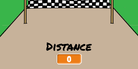
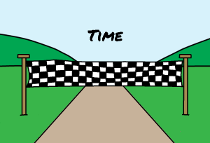

## Going the distance

Let's move the finish line when the arrow keys are pressed.

--- task ---

You want to allow the player to press the arrow keys __until they have run 100 meters__. To do this, create a new variable called `distance`{:class="blockdata"}.

[[[generic-scratch-add-variable]]]

--- /task ---

--- task ---

You should see your new variable on the stage. Right-click the variable and select 'large readout'.


--- /task ---

--- task ---

Drag your variable to the bottom of the stage.



--- /task ---

--- task ---

Set the `distance`{:class="blockdata"} to 0 when the flag is clicked.


```blocks
when green flag clicked
+set [distance v] to [0]
go to x: (0) y: (30)
set size to (1) %
```

--- /task ---

--- task ---

Once your race starts, your player should sprint __until they have run 100 meters__.


```blocks
when I receive [start v]
repeat until <(distance :: variables) = [100]>
end 
```

--- /task ---

--- task ---

Add code so that your finish line gets a little bigger after the player presses the left arrow key. The distance should also increase.


```blocks
when I receive [start v]
repeat until <(distance :: variables) = [100]>
+wait until <key [left arrow v] pressed?>
+ change size by (1)
+ change [distance v] by (1)
end 
```

--- /task ---

--- task ---

Click the green flag to test your project. You should see that the finish line gets bigger when the left arrow is pressed, but doesn't move along the track.



--- /task ---

--- task ---

To fix this, you can add code to move the finish line down slightly each time a key is pressed.


```blocks
when I receive [start v]
repeat until <(distance :: variables) = [100]>
wait until <key [left arrow v] pressed?>
change size by (1)
+change y by (-1.5)
change [distance v] by (1)
end 
```

--- /task ---

--- task ---

Test your project again and you should see the finish line move down the stage towards you.


--- /task ---

--- task ---

You should then do the same for the right arrow key.


```blocks
when I receive [start v]
repeat until <(distance :: variables) = [100]>
wait until <key [left arrow v] pressed?>
change size by (1)
change y by (-1.5)
change [distance v] by (1)
+wait until <key [right arrow v] pressed?>
+change size by (1)
+change y by (-1.5)
+change [distance v] by (1)
end 
```

--- /task ---

--- task ---

If you click to see the finish line's costumes, you should see that there are 2.


--- /task ---

--- task ---

You can switch to the 'broken' costume (and end the game) at the end of the race. Remember to switch to the 'normal' costume at the start of the race!


```blocks
when I receive [start v]
repeat until <(distance :: variables) = [100]>
wait until <key [left arrow v] pressed?>
change size by (1)
change y by (-1.5)
change [distance v] by (1)
wait until <key [right arrow v] pressed?>
change size by (1)
change y by (-1.5)
change [distance v] by (1)
end 
+switch costume to [broken v]
+stop [all v]
```

```blocks
when green flag clicked
+switch costume to [normal v]
set [distance v] to [0]
```

--- /task ---

--- task ---

If you want to play a sound at the end, you'll have change your `stop all`{:class="blockcontrol"} block to `stop other scripts in sprite`{:class="blockcontrol"}.

This means that the timer you'll create will stop counting, but the sound will still play.


```blocks
switch costume to [broken v]
+ stop [other scripts in sprite v]
+ play sound [cheer v]
```

--- /task ---

Have you noticed that you can cheat your game by just holding down the left and right arrow keys?

--- task ---

To fix this, you need to make sure that each key is pressed __and then released__ before moving the finish line.

Here's the code you'll need to add:


```blocks
wait until <key [left arrow v] pressed?>
+wait until <not <key [left arrow v] pressed?>>
change size by (1)
```

You'll need to do the same for the right arrow key.


```blocks
wait until <not <key [right arrow v] pressed?>>
```

--- /task ---
