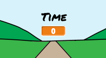
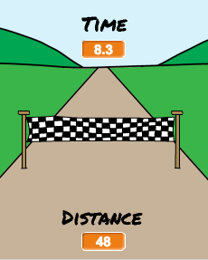

## Who is the fastest?

Let's add a timer to your game, to see who can sprint the fastest.

--- task ---

Create a new `time`{:class="blockdata"} variable, and move it to the center of your stage.



--- /task ---

--- task ---

Set the time to 0 at the start of your game.


```blocks
when green flag clicked
switch costume to [normal v]
set [distance v] to [0]
+ set [time v] to [0]
go to x: (0) y: (30)
set size to (1) %
```

--- /task ---

--- task ---

Add this code to make your timer count up when the game starts.


```blocks
when I receive [start v]
forever
wait (0.1) secs
change [time v] by (0.1)
end
```

--- /task ---

--- task ---

Test your project by clicking the green flag. You should see your timer counts up until you've sprinted 100 meters.



--- /task ---

